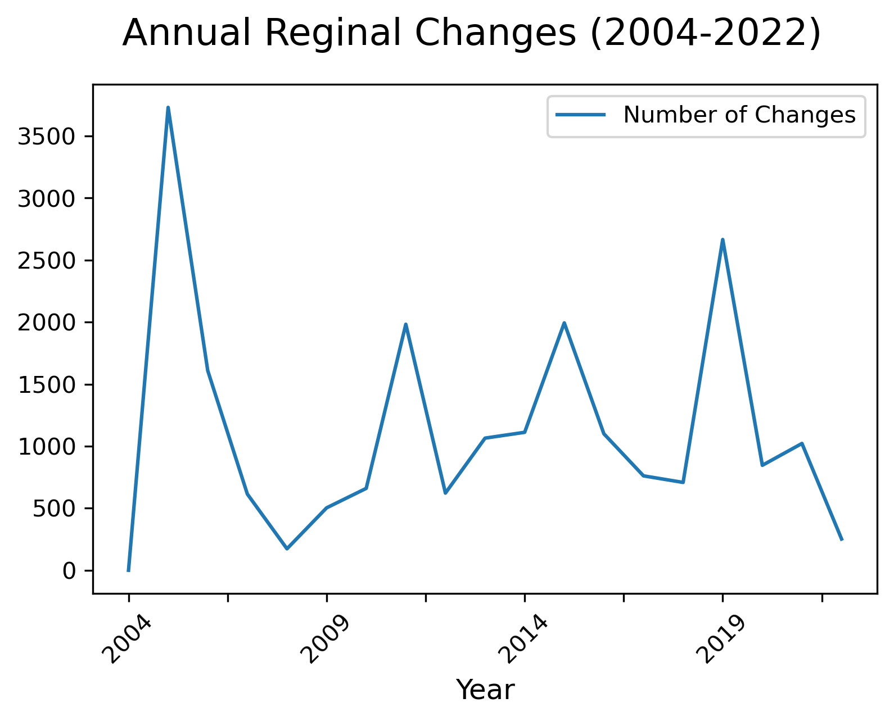
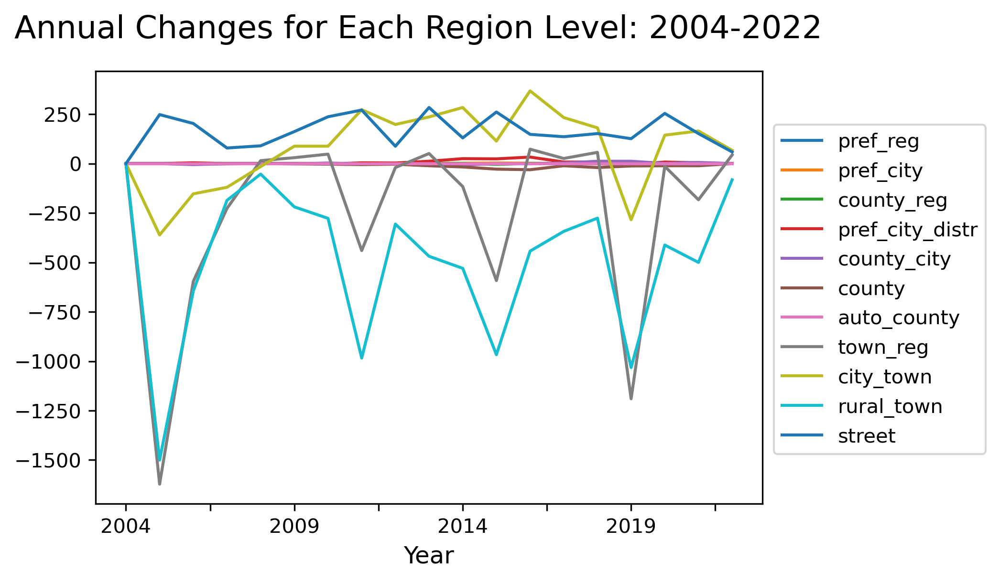
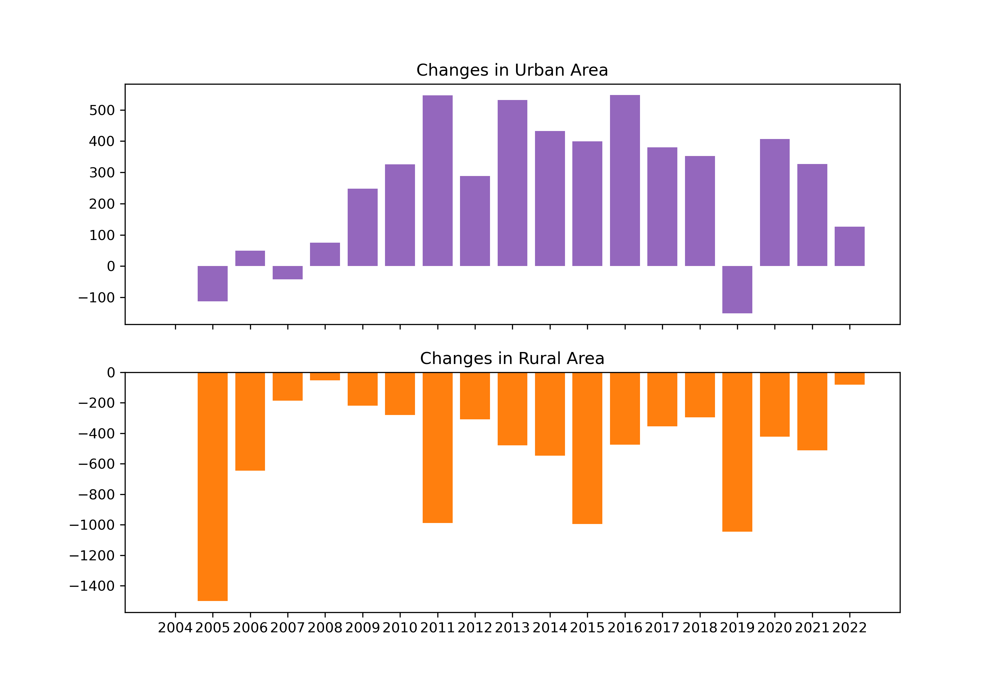
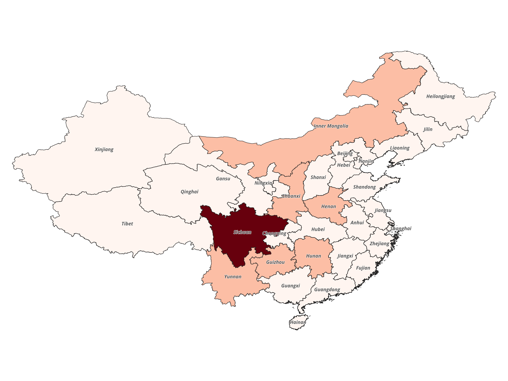
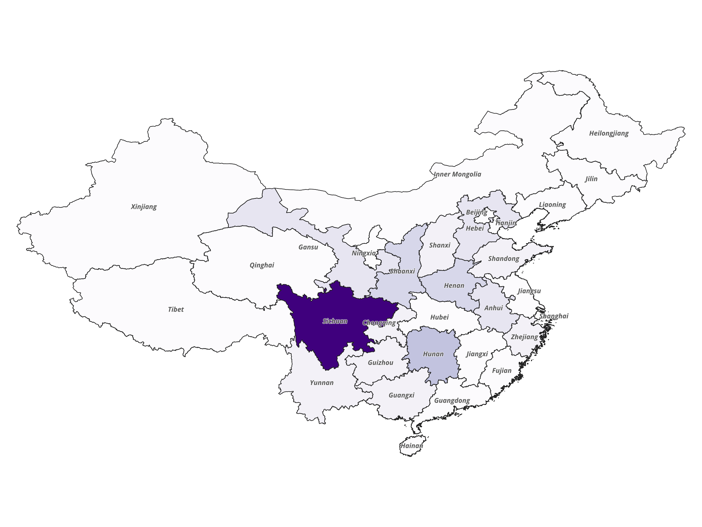
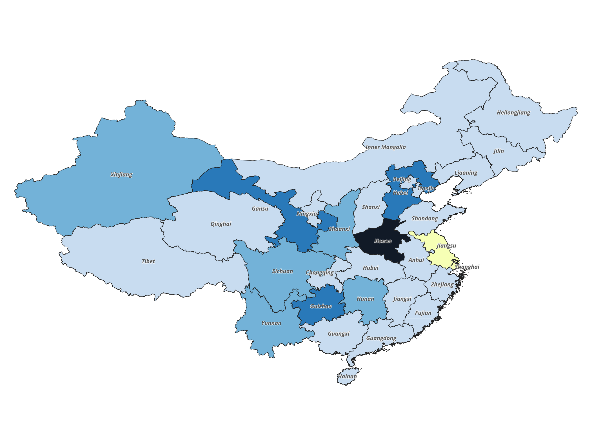
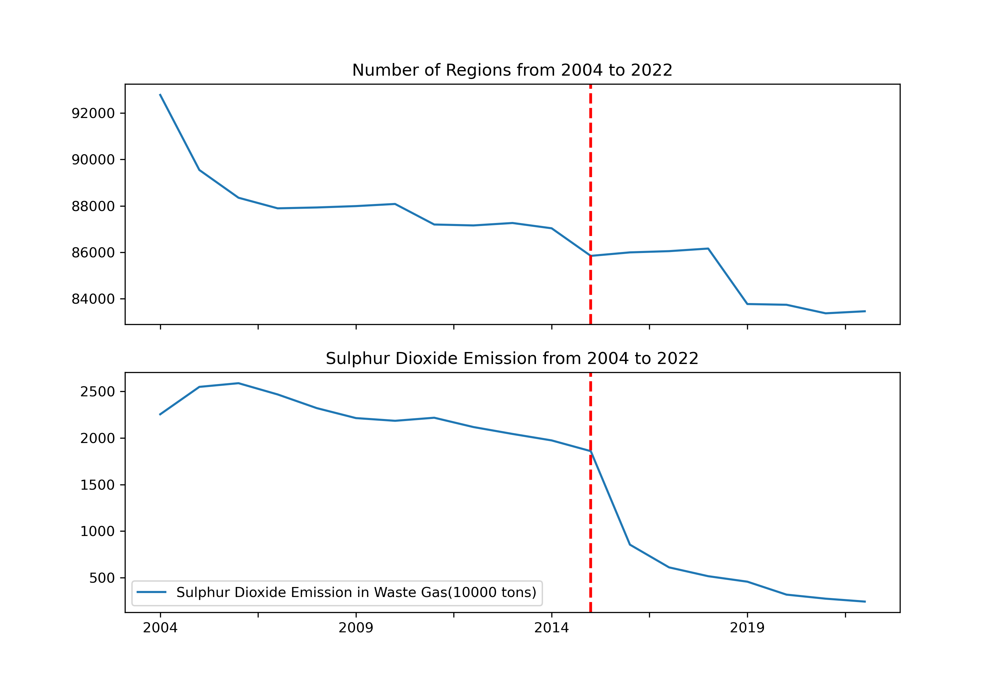
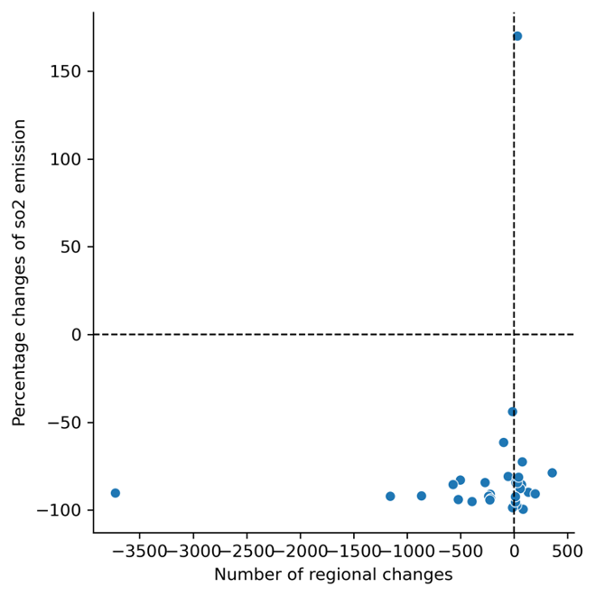
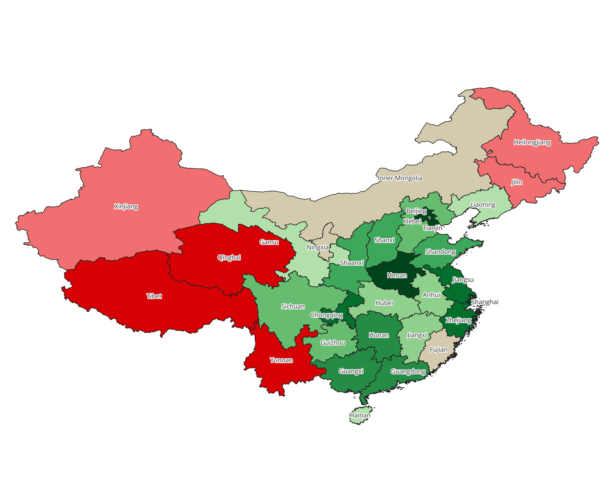

# Regional mergers and air pollution in China

## Motivating question

Regional mergers have happened frequently these years in China, significantly impacting the lives of local residents. There are several potential explanations for this trend.  Some people argued that local governors may leverage regional changes to gain more attention and secure more grants from the central government. Others consider the mergers an opportunity to enhance cooperation between regions, especially in tackling pollution control and addressing poverty issues. This project will focus on the general trends in regional changes from 2004 to 2022, explore the characteristics of these changes, and evaluate whether air pollution alleviation is a plausible explanation for the mergers.

## Summary

There are numerous regional changes each year, with consolidations occurring more frequently than divisions. Consequently, the total number of regions is showing a downward trend. As we delve into these changes, we find that they predominantly occur in lower-level and rural regions. Upon checking each province, Sichuan province, which is known for the high poverty rate and complex terrain, leads in the number of total regional changes.

The yearly count of the regions and sulfur dioxide emissions in waste gases each year showed a parallel trend from 2004 to 2015. A sharp reduction in sulfur dioxide emissions occurred after 2015, the same year the central government issued a law aimed at reducing pollution, causing these two trends to decouple. Data from the provinces also proved that there is no significant linear relationship between the number of regional changes and sulfur dioxide emissions Thus, the alleviation in air pollution might be a side effect of the mergers rather than the main goal, and the primary objective of the consolidations may be driven by other considerations.

## Input data

The data of numbers of administrative areas and sulphur dioxide emissions are all from the National Bureau of Statistics of China. You can download all the data with registeration from the websites below.

This [link](https://data.stats.gov.cn/english/easyquery.htm?cn=C01) is where you can find nation’s data of divisions of administrative areas and sulphur dioxide emissions for last 20 years.

Here is the instruction:

For the administrative divisions’ data, click General Survey on the left of the page, choose Divisions of Administrative Areas beneath it, then choose the data for the last 20 years on the upright of the page.

For national data of sulphur dioxide emissions, click Resources and Environment on the left, then choose Main Pollutant Emission in Waste Gas (10000 tons), set the year option to Last 20.

This [link](https://data.stats.gov.cn/english/easyquery.htm?cn=E0103) is where you can find data of divisions of administrative areas and sulphur dioxide emissions for last 20 years for each province.

Here is the instruction:

For the administrative divisions’ data, click General Survey on the left of the page, choose Divisions of Administrative Areas beneath it, then choose the data for the last 20 years on the upright of the page, you can download each province’s data by changing the region to it.

For provinces’ sulphur dioxide emissions data, click Resources and Environment on the left, then choose Main Pollutant Emission in Waste Gas (10000 tons), set the year option to Last 20, then set the Region to Series and Indicators to Sulphur Dioxide Emission in Waste Gas (10000 tons).

Here is the [website](https://gadm.org/download_country_v3.html#google_vignette) for downloading the Geopakage file for China, click the Geopakage button and it will be downloaded automatically.

## Script

There are four Python scripts in the project.

1. `clean.py`. This script is to clean the area divisions data downloaded from the website. Please open the folder ‘Annual_by_Province’ when running the script.

1. `regional_change_analysis.py`. This file is to analysis and plot the trend and the number of changes in both country and each province. Stay in the folder ‘Annual_by_Province’.

1. `province_detail.py`. This script is to calculate the changes in each province and merge the csv file with the Geopakage file of China.

1. `so2.py`. This script is to analysis country and province's sulphur dioxide emission in Waste Gas(10000 tons) from 2004 to 2022, compare them with the change in number of administrative areas and merge with the gpkg file of China. Please open the folder ‘so2data’ when running the script.

## Results

### Trends in Changes of Administrative Regions

This line chart shows the annual changes in the number of administrative regions. We can see that changes occur every year, with as many as several thousand in some years and at least several hundred in others. Additionally, every 4-5 years, there tends to be a peak period of adjustments to the administrative regions.

This graph further details the annual changes in the number of administrative regions at each level from 2004 to 2022. We can observe a strong stability in the number of higher-level regions. However, the number of townships, especially rural townships, shows a very clear declining trend.

When comparing changes occurring in urban areas to those in rural areas, it is evident that the number of administrative regions in cities is increasing, while the number in rural areas is decreasing, with the rural reductions outnumbering the urban increases significantly.

These two maps respectively visualize the total number of changes and changes in rural areas in each province since 2004. Those provinces in central China, for example Sichuan and Gansu,  which share two common characteristics, high poverty rates and more complex terrain, lead in both changes.

Provinces experiencing significant decreases in the number of administrative regions in rural areas are also seeing increases in urban areas, likely due to the urbanization process as more people move to cities. It is important to note the yellow part of this map, which includes Zhejiang and Shanghai. These areas are continuously reducing the number of urban administrative regions, diverging from the national trend as they streamline their cities.

### Do the changes in administrative regions helped in alleviate air pollution?

Next, we will examine whether changes in regional divisions have contributed to controlling air pollution in China.

This line graph compares the number of regions with sulfur dioxide emissions from waste gases. Initially, the two trends aligned, but the slope of the changes in regional numbers was significantly steeper than that of the reduction in sulfur dioxide emissions, until marked by a red line in 2015. This year, the central government enacted a law on air pollution and allocated substantial funds and resources to address it. After this year, a sharp reduction in sulfur dioxide emissions occurred, which thereafter appeared to decouple from changes in the number of regions.

This scatter plot demonstrates that there is no significant linear relationship between the number of regional changes in each province and sulfur dioxide emissions. A plausible explanation for this might be that in China, controlling environmental pollution—a task that does not immediately yield economic benefits—is primarily influenced by directives from the central government, with other factors playing a secondary role.

This is an addition map shows how much each province have reduced the sulfur dioxide emissions. Provinces in the central and eastern parts have performed better than those along the border. 

## Key Findings

+ There are numerous regional changes in China every year.
+ More consolidations happened in the Rural areas.
+ Provinces in the central part of China that are poor or have complex terrain have the highest number in regional changes.
+ The significant decrease in sulfur dioxide levels is more likely due to the central government's focus on environmental issues in 2015, rather than regional consolidation or division.
